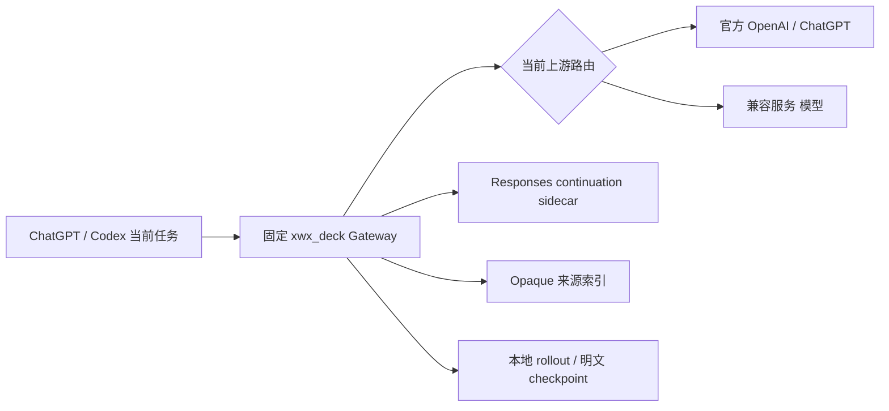
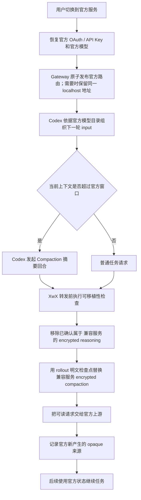

# Codex 上下文压缩、Rollout 与跨上游可移植性

> 核对日期：2026-08-15
>
> 适用范围：XwX Deck 1.1.1 当前工作区
> 本文是 ChatGPT/Codex 在官方服务与 兼容服务 之间切换时，上下文压缩与历史兼容行为的术语和流程基准。

## 0. 一句话解释：为什么切换 Provider 后还能继续

XwX Deck 没有把官方服务里的“服务端会话”迁移到 兼容服务，也没有把 兼容服务 的内部状态上传给官方。它实际做的是三件事：

1. 尽量让 ChatGPT 始终连接同一个本地 `xwx_deck` Provider 和同一个 Gateway 地址，切换时只改变 Gateway 后面的目标上游；
2. 当新上游不能识别旧上游的 `previous_response_id` 时，在本地把最近观察到的可见消息、工具调用和工具结果展开成显式输入；
3. 对旧上游签发的 encrypted reasoning / compaction，不尝试解密，而是按来源决定保留、删除或替换成本地可读的明文检查点。

因此，用户看到的是“原任务继续”，但底层并不是两个 Provider 共享了同一个远端 conversation。更准确的描述是：**XwX Deck 把旧 Provider 的可见对话语义重新组织成新 Provider 能接受的下一轮请求。**



## 1. 先区分四个对象

| 对象 | 谁产生 | 保存或出现在哪里 | 作用 |
|---|---|---|---|
| 当前请求上下文 | Codex 客户端 | 发往 `/responses` 的 `input` | 本轮真正交给模型的消息、工具和状态 |
| Compaction（上下文压缩） | Codex、官方服务或 XwX 合成兼容层 | 当前请求/响应与本地 rollout | 把超长任务整理成更小的接力状态 |
| 本地 rollout | Codex 客户端 | `$CODEX_HOME/sessions/**/*.jsonl` 或 `archived_sessions` | 保存任务事件流水和压缩记录 |
| XwX 明文检查点 | XwX 从可读摘要或 rollout 恢复 | 转换后的普通 `message` | 替代无法跨上游验证的加密 compaction |

这四者不能互换：rollout 是本地历史证据，不是每轮请求；明文检查点是可移植的接力说明，不是密文解密结果；兼容转换解决“能不能读”，Compaction 解决“装不装得下”。

## 2. 为什么需要 Compaction

模型的上下文窗口必须同时容纳：

- 系统和开发者指令；
- 用户消息与助手可见回答；
- 工具声明、工具调用和工具结果；
- reasoning 与既有 compaction 状态；
- 当前新消息和本轮输出预留。

当渲染后的上下文接近或超过当前模型窗口，完整历史不能继续原样发送。Compaction 会让模型生成一份有损但可继续工作的接力摘要，保留进展、决定、约束、关键文件和剩余步骤，舍弃重复讨论、过长日志和不再需要的中间细节。

切换上游本身不是强制压缩指令，但会改变 Codex 当前采用的模型目录和窗口上限。例如同名模型在 兼容服务 目录中可能声明约 105 万 token，而官方目录只声明 27.2 万 token；一个在 兼容服务 下增长到 44 万 token 的任务，切到官方后的第一轮必须先缩小上下文。

OpenAI 官方说明同时定义了两种 API 级 Compaction：

- 在普通 `/responses` 请求中设置 `context_management.compact_threshold`，越过阈值后由服务端在同一响应流中压缩；
- 显式调用无状态 `/responses/compact`，把返回的完整 compact 输出作为下一轮规范输入。

Codex 客户端还可以发起一个独立的摘要回合：通过普通 `/responses` 让模型生成 `CONTEXT CHECKPOINT COMPACTION` 接力摘要，再在本地写入 `compacted` 事件。2026-08-13 本机观察到的 兼容服务 → 官方首轮压缩属于这种客户端摘要回合，而不是切换按钮直接调用 `/responses/compact`，也没有使用 `context_management`。

官方参考：[Compaction](https://developers.openai.com/api/docs/guides/compaction)。

### 2.1 官方 API 对“会话继续”的定义

理解 XwX Deck 的实现前，先看官方接口本身提供了什么：

- OpenAI Responses API 可以通过 `previous_response_id` 把本轮输入接到上一条 Response 后面；官方也提供持久 Conversation 对象，用于在同一 OpenAI 状态域内保存和继续 conversation。参考：[Conversation state](https://developers.openai.com/api/docs/guides/conversation-state)。
- `previous_response_id` 本质上仍是目标服务保存或签发的响应标识。官方文档没有定义把一个 Provider、base URL、账号或兼容网关生成的 response ID 交给另一个 Provider 后仍然有效。
- OpenAI 的 reasoning 模型在无状态使用场景下，可以返回 encrypted reasoning content，调用方需要在后续请求中把相应 reasoning item 带回。该密文是用于后续推理续接的 opaque 状态，不是客户端可解释的通用摘要。参考：[Reasoning models](https://developers.openai.com/api/docs/guides/reasoning)。
- OpenAI Compaction 返回的 compact item 同样是 opaque 的接力状态；官方要求把 compact 输出原样带入后续 Responses 请求，而不是由客户端解析或改写其内容。参考：[Compaction](https://developers.openai.com/api/docs/guides/compaction)。
- 工具调用不是一段普通文本。后续输入必须维持 tool call 与 tool result 的对应关系；reasoning 模型还要求保留相关输出项。参考：[Function calling](https://developers.openai.com/api/docs/guides/function-calling)。
- Anthropic Messages API 明确采用无状态请求模型：调用方每次提交需要的消息历史；工具调用通过 `tool_use` / `tool_result` 成对表达。参考：[Messages API](https://platform.claude.com/docs/en/api/messages) 与 [Tool use](https://platform.claude.com/docs/en/agents-and-tools/tool-use/implement-tool-use)。

这些官方机制都解决“在同一个状态域里继续”，没有提供跨 Provider 搬运 opaque conversation state 的标准协议。因此 XwX Deck 不能简单地把旧 `previous_response_id`、encrypted reasoning 或 encrypted compaction 原样转发给新上游；它必须在本地建立一层最小兼容状态。

## 3. 本地 rollout 是什么

Rollout 是 Codex 为一个任务持续追加的 JSONL 事件日志，默认位于：

```text
$CODEX_HOME/sessions/YYYY/MM/DD/rollout-...-<thread-id>.jsonl
$CODEX_HOME/archived_sessions/.../rollout-...-<thread-id>.jsonl
```

JSONL 表示每一行都是一个独立 JSON 事件。常见事件包括：

| 事件 | 含义 |
|---|---|
| `session_meta` | 任务 ID、工作目录、provider 和来源等元信息 |
| `turn_context` | 某一轮模型、执行环境和策略 |
| `response_item` | 用户/助手消息、reasoning、工具调用和工具结果 |
| `compacted` | Codex 已保存的接力摘要与 replacement history |
| `event_msg` | 运行状态和用量等事件 |

Rollout 不是 Trace。两者区别如下：

| Codex rollout | Trace |
|---|---|
| Codex 任务的本地事件流水 | Gateway 捕获的一次次真实 HTTP 请求与响应 |
| 用于恢复任务、保存消息和压缩边界 | 用于查看最终上游、协议、Token、耗时和错误 |
| 一个逻辑任务可能因客户端内部行为出现多个物理片段 | XwX 在展示层按 conversation key 归并 Trace Session |

Codex 平时会自行组织下一轮请求，XwX Deck 不会每轮从 rollout 重建完整上下文。只有请求中包含不能交给目标上游的加密 compaction、而 XwX 必须提供可读替代物时，XwX 才只读对应 rollout 作为恢复来源。

## 4. 什么是 XwX 明文检查点

明文检查点是一条供应商无关的普通文本消息，内容类似：

```text
任务目标：修复官方服务与 兼容服务 切换后的旧对话续接。
已完成：稳定 Gateway 地址、认证隔离、opaque 来源索引。
关键决定：兼容服务 Key 不发送给官方；未知旧密文在官方方向保守保留。
剩余步骤：真实账号端到端验证、重新打包。
```

在线路上，它表现为普通 Responses 消息：

```json
{
  "type": "message",
  "role": "user",
  "content": [{ "type": "input_text", "text": "...接力摘要..." }]
}
```

它能被官方服务和 兼容服务 共同读取，但不等于：

- 解密了另一供应商的 reasoning 或 compaction；
- 还原了隐藏 reasoning；
- 保存了原历史的每个字；
- 修改了用户在界面中输入的原始消息。

它的准确含义是：从本地仍可读的证据中恢复一份足够继续工作的有界接力状态。

## 5. XwX 如何取得明文检查点

Gateway 从请求头或客户端元数据取得 `thread_id` / `session_id`，在 `sessions` 和 `archived_sessions` 中寻找文件名包含该 ID 的 rollout。恢复顺序是：

1. 读取最后一个可用 `compacted.payload.message`；
2. 若没有正文，读取 `replacement_history` 中已有的接力摘要；
3. 若没有任何压缩摘要，从 `response_item` 提取用户消息、助手可见回答、工具调用和工具结果；
4. 若仍无法恢复，插入明确的“旧检查点不可解码且未找到本地明文”说明，让目标模型从剩余可见历史继续。

第 3 层兜底是有界的：单项最多约 6,000 字符，总计最多约 60,000 字符；超出预算时优先丢弃更早的内容。XwX 不会把整个大型 rollout 再塞回请求，也不会把 reasoning 密文当成明文。

## 6. Opaque 状态及来源索引

Responses 历史可能包含供应商签发的不可读状态：

```json
{ "type": "reasoning", "encrypted_content": "..." }
{ "type": "compaction", "encrypted_content": "..." }
```

这些 opaque 内容只能由签发它的上游验证。XwX 在成功响应后记录其哈希、上游身份、上游类型、项目类型和时间；不把凭据写入来源索引，也不依靠尝试解密来判断来源。

每个 Responses 请求转发前，Gateway 会遍历 Codex 已组织好的 `input`：

- 普通消息、工具调用和工具结果原样保留；
- 目标上游可验证的 opaque 项原样保留；
- 明确来自另一上游的 encrypted reasoning 移除；
- 发往任意原生 Responses 上游时，没有 `encrypted_content`、只能引用未持久化 `rs_*` ID 的 bridge reasoning 移除，关联 assistant 正文保留；Chat Completions / Anthropic Messages 转换路由仍可消费其本地摘要；
- 明确来自另一上游的 encrypted compaction 替换成明文检查点；
- XwX 自己生成的 `xwxc1:` 透明摘要直接解码成普通明文检查点。

转换发生在送往上游的请求副本上。只有 ChatGPT 已完全退出、不会继续写本地历史时，安全停服流程才允许把已经证明属于另一上游的 opaque 行和官方无法重放的无密文 reasoning 行从 rollout 物理清理；清理前逐文件备份并写 manifest，使用原子替换，失败则回滚。

## 7. 兼容服务 → 官方的完整顺序



关键边界：

- XwX 不会因为按钮切换就无条件压缩；Codex 根据官方模型窗口决定是否压缩。
- 官方目标下，只删除来源索引明确证明属于 兼容服务 的 opaque 项。
- 没有来源索引的旧 opaque 项默认可能是原生 OpenAI 历史，官方方向保守保留，避免破坏本来有效的官方老任务。
- 如果官方返回 `invalid_encrypted_content`，XwX 隔离被拒绝项；不自动重发失败请求，用户下一次手动重试再使用净化后的历史，避免重复执行工具操作。

## 8. 官方 → 兼容服务 的完整顺序

这一方向更严格：兼容服务 无法验证旧版无来源索引的原生 OpenAI opaque 内容。

1. 在发布 兼容服务 路由前持久化 provider transition；
2. 保持 `model_provider = "xwx_deck"` 和稳定本地 Gateway 地址；
3. 已加载任务仍缓存官方远端地址时不会经过 Gateway；连接未切换时由用户手动重启 ChatGPT；
4. 首个进入 Gateway 的普通请求或 Compact 请求开始执行转换；
5. 已确认属于官方的 encrypted reasoning 被移除；
6. 官方 encrypted compaction 被替换为明文检查点；
7. 在切换窗口内，无来源索引的旧 opaque 项也按官方历史严格剥离；
8. 根据目标模型协议，Gateway 选择 Responses 直通、Chat Completions bridge 或 Anthropic Messages bridge；
9. 兼容服务 首个成功响应确认转换完成并清除 transition 标记。

兼容服务 模型原生支持 `/responses/compact` 时可直接使用；否则 XwX 让当前模型执行一次无工具、非流式摘要回合，再用 `xwxc1:` 透明信封返回 Codex 所需的 compact 形状。该合成 Compact 是协议兼容，不是对另一供应商密文的解密。

### 8.1 一次普通切换实际经过哪些步骤

假设当前任务已经完成三轮：

```text
用户 A → 助手 A → 用户 B → 助手 B → 用户 C → 助手 C
```

客户端下一轮可能只发送：

```json
{
  "previous_response_id": "resp_from_old_provider",
  "input": [{ "role": "user", "content": "继续处理剩余问题" }]
}
```

切换后，XwX Deck 按以下顺序处理：

1. 切换按钮先持久化 `{source, target}` transition，再发布目标路由；配置文件只有在路由已经可用后才指向 Gateway。
2. 已经进入 Gateway 的旧请求保留接收时的路由快照，不会在上传或流式响应中途被改投新上游。
3. 下一条请求进入时，sidecar 检查 `resp_from_old_provider` 是否属于当前目标 identity。
4. 如果不属于，沿本地 response chain 展开为 A/B/C 三轮可见 input/output，并删除旧 `previous_response_id`。
5. 工具调用和工具结果按 `call_id` 配对、去重；缺少唯一原调用时在转发前返回 409，绝不猜测或重新执行工具。
6. portability 层再处理 encrypted reasoning、encrypted compaction 和 bridge message ID。
7. 根据目标模型能力，把请求保持为 Responses，或转换为 Chat Completions / Anthropic Messages。
8. 只有目标 Provider 成功处理首个可见主请求，transition 才清除。标题、记忆、Compact、utility 或 SubAgent 请求成功都不能提前提交切换。

这也是“切换看起来很流畅”的关键：对于已经连接到 Gateway 的任务，客户端地址不变，改变的是本地 Gateway 的上游路由和下一轮请求内容。

## 9. 三类“压缩/恢复”不要混用

| 名称 | 目的 | 是否减小上下文 | 是否解决跨供应商密文 |
|---|---|---:|---:|
| Codex/官方 Compaction | 让超长任务适配模型窗口 | 是 | 否 |
| XwX 合成 Compact | 为不原生支持 Compact 的 兼容服务 协议补齐响应形状 | 是 | 间接产生可移植的 `xwxc1:` 摘要 |
| XwX 明文检查点替换 | 替代目标上游不能验证的 encrypted compaction | 不保证；只做有界恢复 | 是 |

因此切换后的第一轮可能同时涉及两个独立动作，但先后关系由 Codex 已经发出的请求决定：Codex 先依据目标模型目录和窗口组织普通请求或 Compact 请求；请求到达 Gateway 后，XwX 只转换这份请求副本中目标上游不能验证的 opaque 状态，再把可读请求交给目标上游。XwX 的供应商兼容转换不会先于 Codex 决定是否压缩，也不会由切换按钮主动触发压缩。

## 10. 失败、降级和不可恢复边界

- `502 Bad Gateway` 不会自动删除 rollout；Gateway 恢复后可回到原任务手动重试。
- `invalid_encrypted_content` 表示目标上游无法验证某个 opaque 项，不表示所有可见历史都已丢失。
- XwX 不自动重发失败请求，因为上一轮可能已经执行过工具或产生外部副作用。
- 后续手动重试可能利用已标记失效的来源和本地明文检查点，但没有固定重试次数保证；路由仍绕过 Gateway、目标继续拒绝其他密文或缺少明文证据时，任务仍可能失败。
- 只有存在于不可解密 opaque 内容、且本地没有摘要、可见消息、工具记录或备份的信息，无法保证完整恢复。
- 明文检查点和语义 Compaction 都是有损表示；原始 rollout 仍可作为本地审计证据，但不代表模型下一轮仍会逐字看到全部历史。

### 10.1 对话非常长、已经压缩很多次时怎么办

多次 Compaction 不是把所有摘要无限叠加。可以把一个长任务理解为：

```text
[历史 1..80] --Compact A--> [摘要 A + 81..140]
                         --Compact B--> [摘要 B + 141..220]
                         --Compact C--> [摘要 C + 221..当前]
```

正常情况下，最新的摘要 C 已经概括了 A、B 以及其后的关键进展。XwX Deck 的恢复策略因此是“最后可信检查点 + 检查点之后的增量”，而不是重新拼接 A、B、C 和全部原文：

1. 在 rollout 中寻找最后一条带可读 `message` 或 `replacement_history` 的 `compacted` 事件；
2. 记录该 JSONL 行的起始字节、结束字节和 SHA-256，作为高水位边界；
3. 下次恢复时先验证文件没有缩短、边界行哈希仍然一致；
4. 校验通过后，只扫描该边界之后新增的完整 JSONL 行；
5. 生成“最新明文摘要 + 压缩后新增的用户消息、助手可见回答、工具调用和结果”；
6. 如果 rollout 被迁移、修复或重写导致边界校验失败，废弃旧偏移，从文件头重新寻找最新可信 Compaction，不能盲信历史 offset。

这套处理有几个重要结果：

- **压缩十次也不会发送十份摘要。**恢复时以最后一个可信 Compaction 为主，早期摘要已经被后续摘要语义覆盖。
- **最新 Compaction 来自旧 Provider 且只有密文时，不会解密。**Gateway 用同一 thread 的本地 `compacted.message`、`replacement_history` 或可见 rollout 记录生成明文检查点。
- **最新摘要之后发生的工作不会丢掉。**高水位之后的可见增量会附加在检查点后面，包括新消息和工具结果。
- **最近一小时内的未压缩 Responses 链优先走 sidecar。**它比扫描 rollout 更精确，能保留最近几轮 input/output 与工具配对；sidecar 缺失或 `previous_response_id` 无法解析时才回退到 rollout 检查点。
- **目标模型仍可能再次压缩。**当新 Provider 的上下文窗口更小，“明文检查点 + 新增增量”仍可能超过窗口；此时由 Codex 或目标服务按自己的模型限制再次 Compaction。这和 XwX Deck 的跨 Provider 净化是两个独立动作。

本地恢复是刻意有界的：

| 层 | 当前边界 | 超出时的行为 |
|---|---:|---|
| 单条 sidecar response | 约 2 MiB | 不写入该 entry |
| 单次 sidecar 展开 | 约 8 MiB | 放弃该链，回退检查点 |
| sidecar 总量 | 约 32 MiB / 1,000 responses / 约 1 小时 | 淘汰较旧 entry |
| rollout 可见 transcript 兜底 | 总计约 60,000 字符，单项约 6,000 字符 | 优先移除更早内容并标记截断 |
| checkpoint 索引 | 256 个 / 约 30 天 | 淘汰最旧索引；原 rollout 不删除 |
| opaque 来源索引 | 4,096 项 / 约 90 天 | 淘汰最旧来源记录 |

如果最后只剩旧 Provider 才能验证的密文，并且本地没有可读 Compaction、可见消息、工具记录或备份，那么这部分信息无法可靠恢复。XwX Deck 会明确降级，而不是伪造“完整上下文已经迁移”。

## 11. 实现与验证入口

- 请求可移植性与 rollout 恢复：`src/main/trace/codexConversationPortability.ts`
- Compact 触发识别与合成摘要：`src/main/trace/codexCompaction.ts`
- 转发前转换、来源观察与失败隔离：`src/main/trace/tapProxy.ts`
- 官方/兼容服务 配置和路由切换：`src/main/app/xwxDeckController.ts`
- 模型目录窗口与 Compact 能力：`src/main/trace/codexModelCatalogManager.ts`
- 隔离回归矩阵：`tools/core-smoke.ts`

## 12. 跨 Provider 续接的薄状态层

XwX Deck 不接管同一 Provider 内的日常会话状态。目标上游身份未变化且
仍使用 Responses 协议时，`previous_response_id` 保持原样，继续使用上游
原生 conversation state、prompt cache 和 compaction。

只有 Provider、base URL、账号/凭据身份或目标协议发生变化时，Gateway 才执行
一次有界续接：

1. 不向目标上游发送源上游的 `previous_response_id`；
2. 优先从最近响应的本地 sidecar 展开已观察到的可见 input/output；
3. sidecar 不完整时，使用最后一个本地明文 checkpoint，并只读取其高水位之后的 rollout 增量；
4. `function_call_output` 缺少原调用时，仅按唯一 `call_id` 恢复已经观察到的调用；不能唯一匹配则在转发前失败；
5. sidecar 展开多轮输入时，`model_switch`、skills、应用/权限、协作模式、插件和多 Agent 模式等可刷新 developer 上下文按标签只保留最新一份；普通 system/developer 指令保持原顺序和内容；
6. 目标上游首个成功响应后结束切换窗口，后续立即回到目标 Provider 原生状态。

本地 sidecar 有硬上限：单响应约 2 MB、单次展开约 8 MB、总计约 32 MB、
最多 1,000 个响应、TTL 约 1 小时。只存储可见消息、工具调用/结果和可见
reasoning summary；不保存凭据、encrypted reasoning 或 encrypted compaction。

checkpoint 索引保存 compaction JSONL 行结束位置及内容哈希。使用高水位前必须
重新验证边界哈希；rollout 被迁移、修复或改写后校验失败就从文件重新寻找最近
compaction，不能继续信任旧偏移量。原始 rollout 不由该索引修改。

维护时至少覆盖：官方 → 兼容服务、兼容服务 → 官方、兼容服务 Chat Completions → 兼容服务 Responses、无来源旧密文、已知 foreign reasoning、无密文 bridge reasoning、foreign compaction、`xwxc1:` 合成摘要、真实 `/responses/compact`、`compaction_trigger`、`invalid_encrypted_content` 隔离、失效目标标记跨 helper 重启后仍可 repair、ChatGPT 退出后的备份/原子清理与失败回滚。

## 13. 官方能力与 XwX Deck 兼容层的对应关系

| 官方机制 | 官方解决的问题 | 跨 Provider 时为什么不够 | XwX Deck 的对应处理 |
|---|---|---|---|
| `previous_response_id` | 在同一 Responses 状态域中链接上一响应 | 新 Provider 通常不认识旧 Provider 的 response ID | 展开本地可见 response chain，删除旧 ID |
| Conversation object | 在同一 OpenAI Conversation 中持久续接 | 不是跨厂商 conversation 迁移协议 | 保持本地 thread 身份，不宣称远端对象相同 |
| encrypted reasoning | 在后续请求中继续模型内部推理状态 | 密文只能由签发方验证 | 同源保留，foreign 删除；可见回答仍保留 |
| Compaction item | 缩小上下文并延续同一状态域 | opaque compact 不能交给另一签发方 | 替换成本地明文 checkpoint；目标按需再次 Compact |
| Function/tool calling | 维护工具调用与结果关系 | 丢失原调用可能造成无效结果或重复副作用 | 按 `call_id` 唯一恢复；不唯一则 409，不自动重放 |
| Anthropic stateless Messages | 调用方显式发送本轮需要的历史 | Responses 增量链不能直接作为 Messages 历史 | 转换为完整 messages/tool_use/tool_result 结构 |

结论是：XwX Deck 的续接层不取代任何官方 conversation store。它只在身份或协议边界变化时，构造一份目标 Provider 能读取、工具语义不重复、opaque 状态不越权的有界请求；目标成功接管后立即回到目标 Provider 自己的原生状态机制。
