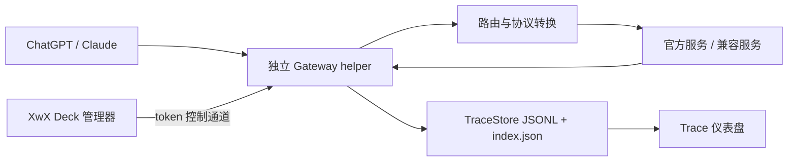

# Trace 捕获、会话归并与恢复机制

> 核对日期：2026-08-13
>
> 适用范围：XwX Deck 1.1.1 当前工作区

本文说明 Trace 实际记录了什么、请求如何归入 Session、为什么会出现看似重复的消息，以及仪表盘应该怎样展示内部请求。Compaction、Codex 本地 rollout、明文检查点和官方/兼容服务 双向转换的权威说明见[Codex 上下文压缩、Rollout 与跨上游可移植性](codex-context-compaction-portability.md)。

## 1. 三个容易混淆的概念

| 概念 | 含义 | 是否等于用户的一次对话 |
|---|---|---|
| Trace | 一次真实 HTTP 模型请求及响应，包括请求体、路由、耗时、Token、错误和流事件 | 否；一次对话会产生很多 Trace |
| Session | Trace 按客户端身份、原生 conversation key、response id 和提示链归并出的记录容器 | 通常对应一个对话，但旧数据或客户端内部线程可能产生片段 |
| Conversation | ChatGPT、Claude 或 Copilot 中用户看到的任务/对话 | 是产品层应展示的主对象 |

因此“请求数量很多”不一定是重复请求。工具续接、compact、标题生成、Token 预算、策略检查、子 Agent 和记忆维护都可能产生独立 HTTP 请求。

## 2. 捕获链路

- Gateway helper 独占本地端口和 TraceStore 写入。
- 管理器退出时，Gateway 可以继续捕获和转发。
- 每个完成的请求写入一个 JSONL 记录；`index.json` 保存 Session 摘要，不保存完整正文。
- 仪表盘首屏只读取 Session 摘要；进入详情后再按条数和约 24 MB 字节预算分页读取 JSONL。

## 3. 一条 Trace 保存什么

主要字段：

- `source`：`codex-vscode`、`codex-cli`、`claude-cli`、`copilot` 等真实客户端来源。
- `clientConversationKey`：客户端提供的稳定任务/线程 ID；存在时是最强 Session 归属信号之一。
- `request`：请求路径、协议、模型、脱敏后的 headers 和正文。
- `upstream`：请求最终发往哪个上游。
- `response` / `sse`：响应状态、快照和流事件。
- `usage` / `timings`：Token、缓存和阶段耗时。
- `auxiliary`：标题、预算、策略、记忆维护等辅助请求分类。
- `subagent` / `subagentInfo`：子 Agent 名称、调用 ID、父子关系和深度。
- `compact`：本次请求是否是上下文压缩。
- `routedBy`：本条 Trace 为什么归入这个 Session。

## 4. Session 路由优先级

从强到弱：

1. `previous_response_id`：Responses 原生续接 ID。
2. `clientConversationKey`：ChatGPT/Codex/Claude 的原生任务或线程 ID。
3. 子 Agent 的调用根和父子 thread ID。
4. 标题、patch 等辅助请求携带的精确 root hash 或 interaction ID。
5. compact resume、提示链前缀和同根匹配。
6. 受时间窗口保护的同来源兜底。
7. 全部不匹配才创建新 Session。

同一个 `clientConversationKey` 已经存在可见主 Session 时，必须优先选择可见主 Session，不能因为一个更新的 hidden utility bucket 刚刚创建，就把后续主请求吸收到内部请求中。

## 5. 请求分类与默认显示

| 类型 | `auxiliary` / 标记 | 默认归属 | 建议显示 |
|---|---|---|---|
| 用户主回合 | 无 | 主 Session | 普通编号 |
| 上下文压缩 | `compact=true` | 原 Session | “上下文压缩”琥珀标记 |
| 标题生成 | `title` | 原 Session 或 hidden provisional | “标题生成”辅助标记 |
| Token 预算 | `count` | 原 Session | “Token 预算”辅助标记 |
| 策略检查 | `policy` | 原 Session | “策略检查”辅助标记 |
| Patch/修复辅助 | `patch` | 原 Session | “Patch 辅助”标记 |
| Memory Writing / rollout 分析 | `memory` | 原 Session；无宿主时 hidden | “记忆维护”标记 |
| 其他结构化内部请求 | `utility` | hidden utility；可精确归属时附着主 Session | “内部辅助”标记 |
| 子 Agent | `subagent` | 原 Session | 折叠卡片，显示名字、ID 和深度 |

辅助请求是真实请求，也可能产生费用，因此保留在原始 Trace 中；但它们不应：

- 作为仪表盘独立用户会话；
- 覆盖主 Session 的首条用户消息；
- 因内部请求失败而把整段用户对话标成 `ERR`；
- 被当作新的主回合编号。

## 6. 2026-08-13 现场冗余分析

检查 `http://127.0.0.1:61892/` 和本机 TraceStore 后发现：

- 仪表盘展示 10 个可见 Session。
- 实际只有 4 个不同的 `clientConversationKey`。
- 其中 8 行标题来自 `Memory Writing Agent` 或 `Analyze this rollout...`。
- 当前用户任务同一个 conversation key 被切成 5 个文件片段。
- 旧的皮肤设计任务同一个 conversation key 被切成 2 个文件片段。

根因：

1. Memory Writing 使用结构化 JSON 输出，旧分类只认出“结构化 utility”，没有给它稳定的 `memory` 类型。
2. utility bucket 比原主 Session 更新，按 key 选择“最新 Session”时抢占了主 Session。
3. 后续真实主请求吸收 hidden bucket，使内部 prompt 成为可见标题。
4. 管理器/Gateway 重启后再次重复上述过程，形成多个片段。

当前修复：

- 明确识别 Memory Writing Phase 1、Phase 2 和 rollout JSON 分析为 `memory`。
- 通用结构化内部请求持久化为 `utility`。
- 同 key 路由优先已有可见主 Session。
- `memory` / `utility` 不参与首条消息、主回合错误和主模型的确定。
- 详情侧栏显示“记忆维护”或“内部辅助”。

## 7. 历史片段的合并策略

### 7.1 不直接物理拼接 JSONL

当前 TraceStore 超过 2 GB，单条大上下文请求可达到十几 MB。运行中直接移动或重写多个 JSONL 有以下风险：

- 与 helper 正在追加写入发生竞争；
- 破坏原始请求顺序、`turn`、`sessionId` 和审计证据；
- 大文件改写中断后产生半成品；
- 删除片段时误删仍被引用的真实请求。

因此默认不修改原始文件。

### 7.2 推荐：逻辑 Conversation 视图

仪表盘在展示层按 `source + clientConversationKey` 形成一个 Conversation：

- 代表 `id` 选择最后更新的物理 Session，以便详情请求和实时事件命中当前片段；首条消息、标题、首模型和首客户端则优先取按时间最早出现的可见真实用户片段。这两个职责不能混成“选择最早 Session 作为主记录”。
- 同 key 的其他物理 Session 只作为存储分段参与聚合，不在首页增加“片段”或“内部”标签。
- 主行沿用原有表格，仅聚合请求数、Token、费用、错误和累计处理耗时。
- 点击主行进入统一时间线；详情数据源按时间跨物理 Session 读取请求。
- 详情侧栏按逻辑 Conversation 生成连续、稳定的请求序号；各物理 Session 从 1 重置的原始 `turn` 只保留为审计字段，不参与跨片段排序或展示编号。
- 详情已打开时，同一 `source + clientConversationKey` 的实时新请求即使落入新的物理 Session，也合入当前逻辑时间线并顺延 `logicalTurn`；新物理摘要仍单独保留。用户正位于最新请求时页面继续跟随，浏览历史时不强行跳回尾部。
- 并发子 Agent 仍按这条逻辑时间线严格递增显示。页面离开一个子 Agent 分枝后，再返回该分枝时会在当前位置创建标有“续”的续接卡；不能为了维持一棵连续树，把后到请求插回侧栏前面的旧卡片。
- 记忆维护、内部辅助、上下文压缩、标题生成、Token 预算、策略检查和子 Agent 只在详情侧边栏使用现有特殊请求标签展示。
- 删除 Conversation 时，确认框按后端相同的 `source + clientConversationKey` 规则统计实际删除集合，片段数包括不在总览单独展示的 hidden 辅助片段；确认后删除同 key 的全部物理片段和归属于该 key 的隐藏辅助片段。没有原生 key 的旧 Session 仍只删除自身。

这叫逻辑合并：页面是一段对话，磁盘仍保留原始片段。

### 7.3 旧数据处理（当前实现）

当前没有 Trace 索引迁移 API、迁移预览或迁移账本。Viewer 在每次读取时根据现有 index 中的 `source + clientConversationKey` 动态形成逻辑 Conversation；不改写 index 或 JSONL 正文。

- 存在精确 key 且有真实用户主 Session 时，其他物理片段在展示层合并。
- 纯 Memory Writing/utility 组不进入用户会话总览；能精确归入用户 Conversation 的辅助请求才出现在该详情时间线。
- 没有原生 key 的旧数据不会仅凭提示相似度跨来源自动合并。

如果未来新增物理索引修复，必须先提供只读预览、只按精确 key 分组、保存可回滚账本，并且仍不得改写 JSONL 正文。

## 8. 官方服务与 兼容服务 切换恢复

本节只记录 Trace 视角：请求在切换后仍归入同一逻辑 Conversation，详情应标记 Compact、最终上游和兼容处理。完整数据转换顺序、rollout 读取边界与降级策略统一见[上下文压缩与跨上游可移植性](codex-context-compaction-portability.md)，不要在本文件复制维护另一套规则。

### 官方 → 兼容服务

1. Gateway 先记录 provider transition。
2. 发布 兼容服务 路由。
3. 再更新 ChatGPT 配置。
4. 已加载任务若仍缓存官方远端地址，会绕过 Gateway，既不能转换也不能捕获；先新建任务或继续尝试，连接未切换时再由用户手动重启 ChatGPT。
5. 首个到达 Gateway 的请求，包括首个 `/responses/compact`，在上游调用前检查 opaque reasoning/compaction 来源。
6. 明确属于官方或来源未知的旧密文不会直接交给 兼容服务；优先使用本地明文检查点或摘要。

### 兼容服务 → 官方

1. 恢复官方 OAuth/API Key。
2. Gateway 原子切换到官方上游。
3. 保留同一个 localhost 端口，继续服务 ChatGPT 缓存的旧地址。
4. 完全退出阶段才修复明确属于 兼容服务 的不兼容项、恢复官方直连并停止 helper。

如果 兼容服务 模型目录允许的上下文大于官方目录，切换后的第一轮可能立即显示“上下文压缩”。这是 Codex 按目标模型窗口发起的 Compact，不是 Trace 或服务切换按钮主动制造的用户回合。

### `invalid_encrypted_content`

该错误表示目标上游无法验证另一上游生成的 opaque 内容。处理原则：

- 不猜测官方未知密文属于 兼容服务。
- 有来源索引时只移除明确属于另一服务商的项。
- 上游断连、5xx 或该错误会使相应 opaque 来源失效。
- 优先恢复本地明文或 compaction 摘要。
- 只剩不可解密密文且没有明文/摘要/备份时，不能保证完整恢复。

## 9. 展示设计原则

### 仪表盘

- 一行代表一个逻辑 Conversation，不代表一个 JSONL 文件。
- 默认隐藏纯内部维护 Conversation。
- 首页不展示“片段”“内部”或新增后台标签，继续复用原有表格、来源和状态样式。
- 请求数和总 Token 保留真实费用口径。
- `ERR` 只由最后一次主回合决定；辅助失败单独显示警告。

### Session 详情

- 主回合使用普通编号。
- compact、memory、title、count、policy 使用文字标记，不伪装成普通用户回合。
- `memory` 显示“记忆维护”，未知结构化 `utility` 显示“内部辅助”；两者复用现有特殊请求标签位置和配色。
- 同一类连续辅助请求当前仍逐条显示，并用同类标记及序号区分；尚未合并成“记忆维护 × 4”这类聚合行。
- 并行子 Agent 的卡片可以折叠和保留父子关系，但卡片顺序不得改变 `logicalTurn`；跨分枝恢复使用“续”标记。
- 展开后仍能查看请求路径、模型、Token、上游和原始正文。
- reasoning 密文默认只显示来源、长度和兼容状态，不铺开大段 opaque 内容。

### 审计信息

每条 Trace JSONL 当前直接保留原始 `sessionId`、`clientConversationKey`、`routedBy`、请求/响应和最终上游。逻辑 Conversation 标识与 `logicalTurn` 是读取时从 index 推导的展示字段，不回写原始 JSONL。

provider transition 与 opaque 来源由 portability 状态文件管理；当前的净化/摘要替换数量写入运行日志，没有作为每条 Trace 的持久化字段。因此排障时需要把 Trace JSONL、portability 状态和同一时段的日志结合查看，不能只从详情页反推全部切换过程。

## 10. 排障顺序

1. 仪表盘出现多个相同任务：先比较 `clientConversationKey`，不要只看首条消息。
2. 标题是 Memory Writing/rollout：检查是否已分类为 `memory`。
3. 主会话显示 `ERR`：确认失败的是主回合还是辅助请求。
4. 切换服务商后立即 compact：先比较切换前后的模型窗口，再检查 provider transition 和 portability 来源索引。
5. 页面加载慢：检查 TraceStore 总大小和单页字节预算，不要一次读取全部 JSONL。
6. 需要清理历史：先停止捕获，明确核对将删除的逻辑 Conversation 及物理片段数；当前没有迁移预览，禁止直接批量拼接、改写或删除 JSONL。
